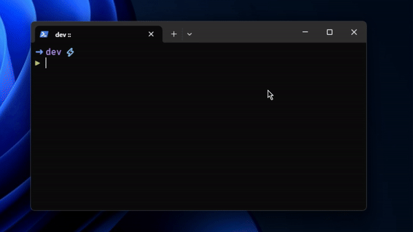

# 👁️ Laneye



Laneye is a CLI tool that analyzes a project directory to determine the percentage of different programming languages used, based on file extensions. It excludes common non-code files like images, documents, and system files, focusing solely on source code files.

## Features

- Recursively traverses directories to list all files.
- Calculates the percentage distribution of programming languages based on file extensions.
- Excludes common media, document, and system files to focus on code files.

## Installation

To install Laneye, you need Node.js installed on your machine. You can install the module globally using npm:

```bash
npm i -g laneye
```

## Usage

To use Laneye, run the command with the path to the directory you want to analyze:

```bash
laneye <directory>
```

For example:

```bash
laneye ./my-project
```

This command will output the percentage of different programming languages used in the specified directory.

## Support

If you want to support my work, you can [buy me a coffee](https://www.buymeacoffee.com/cresvin) ☕

## License

This project is licensed under the [MIT License](License) - see the LICENSE file for details.
